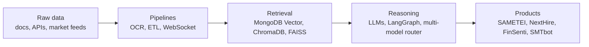
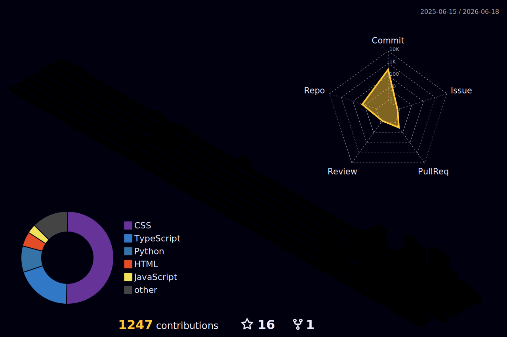
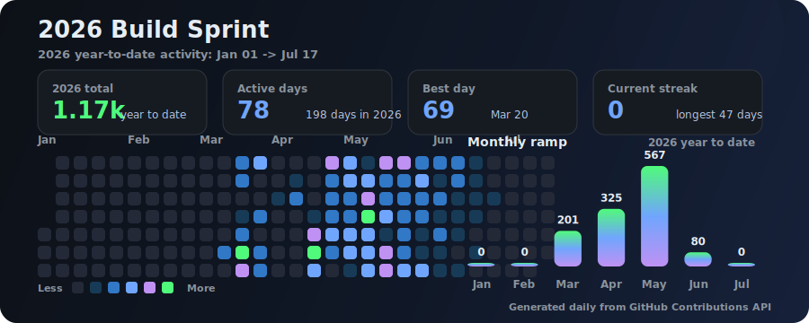

  

  

  
  
  
  

---

## About

I am a Computer Engineering graduate building production AI systems where models meet real data engineering: retrieval pipelines, OCR-heavy document workflows, multi-model routing, and agentic products that need to be fast, observable, and usable.

<table>
  <tr>
    <td width="33%">
      <strong>AI systems</strong> 
      RAG, vector search, OCR, local/cloud LLM routing, cited answers, and evaluation loops.
    </td>
    <td width="33%">
      <strong>Product engineering</strong> 
      FastAPI, React/Next.js, TypeScript, Docker, PostgreSQL, MongoDB, Firebase, and CI.
    </td>
    <td width="33%">
      <strong>Automation</strong> 
      LangGraph agents, Playwright/RPA, n8n workflows, market-data pipelines, and analytics.
    </td>
  </tr>
</table>

---

## Featured Work

<table>
  <tr>
    <td width="50%">
      <h3><a href="https://last-26.web.app/case-smtbot.html">SMTbot</a></h3>
      
Async 24/7 crypto futures scalper on Bybit V5. WebSocket-native pipeline, Pine v6 emulator, Optuna tuning, and a private strategy core.

      
<strong>~24 ms cycle</strong> | <strong>25 pairs</strong> | <strong>~6700x speedup</strong>

      
<a href="https://github.com/last-26/SMTbot-Demo">Demo repo</a>

    </td>
    <td width="50%">
      <h3><a href="https://github.com/last-26/SAMETEI">SAMETEI</a></h3>
      
On-prem RAG assistant for enterprise HR procedures with LibreChat, MongoDB Vector Search, local Ollama models, and Qwen 2.5-VL OCR.

      
<strong>70% faster</strong> document handling | cited answers | air-gapped friendly

    </td>
  </tr>
  <tr>
    <td width="50%">
      <h3><a href="https://github.com/last-26/FinSenti">FinSenti</a></h3>
      
Financial sentiment MLOps pipeline with FinBERT, LoRA/PEFT, MLflow, FastAPI, and Next.js delivery.

      
<strong>91.1% accuracy</strong> | <strong>0.90 F1</strong>

    </td>
    <td width="50%">
      <h3><a href="https://github.com/last-26/NextHire">NextHire</a></h3>
      
LangGraph-powered job application agent: ATS scoring, skill-gap detection, personalized cover letters, and kanban tracking.

      
Multi-model routing | FastAPI | Next.js | PostgreSQL

    </td>
  </tr>
</table>

---

## Tech Stack

  

---

## 3D Contribution Map

  

---

## GitHub Stats

  

  
  

  

---

  

  

